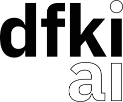

---
# Leave the homepage title empty to use the site title
title: ''
date: 2022-10-24
type: landing

sections:
  - block: hero
    demo: true # Only display this section in the Hugo Blox Builder demo site
    content:
      title: Hugo Academic Theme
      image:
        filename: hero-academic.png
      cta:
        label: '**Get Started**'
        url: https://hugoblox.com/templates/
      cta_alt:
        label: Ask a question
        url: https://discord.gg/z8wNYzb
      cta_note:
        label: >-
          
<a class="github-button" href="https://github.com/HugoBlox/hugo-blox-builder" data-icon="octicon-star" data-size="large" data-show-count="true" aria-label="Star">Star Hugo Blox Builder</a>

<a class="github-button" href="https://github.com/HugoBlox/theme-academic-cv" data-icon="octicon-star" data-size="large" data-show-count="true" aria-label="Star">Star the Academic template</a>

      text: |-
        **Generated by Hugo Blox Builder - the FREE, Hugo-based open source website builder trusted by 500,000+ sites.**

        **Easily build anything with blocks - no-code required!**

        From landing pages, second brains, and courses to academic resumés, conferences, and tech blogs.

        <!--Custom spacing-->
        

        <!--GitHub Button JS-->
        
    design:
      background:
        gradient_end: '#1976d2'
        gradient_start: '#004ba0'
        text_color_light: true
  - block: about.biography
    id: about
    content:
      title: Biography
      # Choose a user profile to display (a folder name within `content/authors/`)
      username: admin
  - block: skills
    content:
      title: Skills
      text: ''
      # Choose a user to display skills from (a folder name within `content/authors/`)
      username: admin
    design:
      columns: '1'
  - block: experience
    content:
      title: Experience
      # Date format for experience
      #   Refer to https://docs.hugoblox.com/customization/#date-format
      date_format: Jan 2006
      # Experiences.
      #   Add/remove as many `experience` items below as you like.
      #   Required fields are `title`, `company`, and `date_start`.
      #   Leave `date_end` empty if it's your current employer.
      #   Begin multi-line descriptions with YAML's `|2-` multi-line prefix.
      items:
        - title: Senior Researcher
          company: German Research Center for Artificial Intelligence (DFKI)
          company_url: ''
          company_logo: DFKI #org-gc # #org-gc
          location: Germany
          date_start: '2022-04-01'
          date_end: ''
          description: 'Lead of the Quantum AI research unit in the IS2 team of the Agent and Simulated Reality Department (DFKI). Our research unit is committed to investigating the feasibility and potential benefits of quantum algorithms across diverse domains of Artificial Intelligence.'
        - title: Researcher
          company: German Research Center for Artificial Intelligence (DFKI)
          company_url: ''
          company_logo: DFKI #org-gc # #org-gc
          location: Germany
          date_start: '2021-08-01'
          date_end: '2022-03-31'
          description: 'My research primarily concentrated on developing and implementing various quantum solutions for specific AI challenges, with applications ranging from collision-free navigation of autonomous vehicles to optimizing flexible production processes in Industry 4.0.'
        - title: Machine Learning SW Engineer
          company: Menarini Silicon BioSystem
          company_url: ''
          company_logo: Menarini #org-gc # #org-gc
          location: Italy
          date_start: '2021-01-01'
          date_end: '2021-07-31'
          description: 'Menarini Silicon Biosystems offers unique rare cell technologies in the study of cells and their molecular characterization. As a machine learning software engineer I worked on designing and testing advanced deep learning algorithms for in vitro diagnostic (IVD) medical devices.'
        - title: PhD Student
          company: University of Bologna
          company_url: ''
          company_logo: unibo #org-gc # #org-gc
          location: Italy
          date_start: '2017-11-01'
          date_end: '2020-12-31'
          description: 'My dissertation focused on the designing and implementing new quantum machine learning algorithms. It offered a dual contribution: a comprehensive quantum framework for supervised learning, and an efficient quantum algorithm for approximating non-linear activation functions.'
        - title: Data Scientist
          company: Cineca
          company_url: ''
          company_logo: Cineca #org-gc # #org-gc
          location: Italy
          date_start: '2016-05-02'
          date_end: '2019-06-30'
          description: 'Developing and deploying machine learning solutions for predicting university student dropout rates, and monitoring and predicting train faults utilizing HPC infrastructure.'
    design:
      columns: '2'
  - block: accomplishments
    content:
      # Note: `&shy;` is used to add a 'soft' hyphen in a long heading.
      title: 'Certifications'
      subtitle:
      # Date format: https://docs.hugoblox.com/customization/#date-format
      date_format: Jan 2006
      # Accomplishments.
      #   Add/remove as many `item` blocks below as you like.
      #   `title`, `organization`, and `date_start` are the required parameters.
      #   Leave other parameters empty if not required.
      #   Begin multi-line descriptions with YAML's `|2-` multi-line prefix.
      items:
        - certificate_url: https://www.credly.com/badges/48b2f067-b25a-467f-a9bd-1ea216186496?source=linked_in_profile
          date_end: ''
          date_start: '2021-12-21'
          description: 'An IBM Qiskit Developer is an individual who understands fundamental quantum computing concepts and is able to express them using the Qiskit open source software development kit (SDK). They have experience using the Qiskit SDK from the Python programming language to create and execute quantum computing programs on IBM Quantum computers and simulators. This individual is able to perform these tasks with little to no assistance from product.'
          icon: ibm
          organization: IBM
          organization_url: https://www.credly.com/badges/48b2f067-b25a-467f-a9bd-1ea216186496?source=linked_in_profile
          title: Certified Associate Developer - Quantum Computation using Qiskit v0.2X
          url: ''
        - certificate_url: https://www.credly.com/badges/f13b0290-a854-4a24-be42-2741c9e0ab00?source=linked_in_profile
          date_end: ''
          date_start: '2020-09-01'
          description: 'This badge earner has gathered a deep level of understanding with Qiskit including circuits, algorithms, simulators, qubits and noise. Through their contributions to the Qiskit and the quantum community, this individual has demonstrated an ability and commitment to educate and influence others by sharing ideas, knowledge and expertise in the field of quantum computing.'
          icon: ibm
          organization: IBM
          organization_url: https://www.credly.com/badges/f13b0290-a854-4a24-be42-2741c9e0ab00?source=linked_in_profile
          title: Qiskit Advocate
          url: ''
    design:
      columns: '2'
  - block: collection
    id: teach
    content:
      title: Teaching
      subtitle: ''
      text: ''
      # Choose how many pages you would like to display (0 = all pages)
      count: 5
      # Filter on criteria
      filters:
        folders:
          - teaching
        author: ""
        category: ""
        tag: ""
        exclude_featured: false
        exclude_future: false
        exclude_past: false
        publication_type: ""
      # Choose how many pages you would like to offset by
      offset: 0
      # Page order: descending (desc) or ascending (asc) date.
      order: desc
    design:
      # Choose a layout view
      view: compact
      columns: '2'
  - block: portfolio
    id: projects
    content:
      title: Projects
      filters:
        folders:
          - project
    design:
      # Choose how many columns the section has. Valid values: '1' or '2'.
      columns: '1'
      view: showcase
      # For Showcase view, flip alternate rows?
      flip_alt_rows: false
  - block: collection
    id: featured
    content:
      title: Recent Publications
      text: |-
        {}
        Quickly discover relevant content by [filtering publications](./publication/).
        {}
      filters:
        folders:
          - publication
        exclude_featured: true
    design:
      columns: '2'
      view: citation
  - block: collection
    content:
      title: PhD Thesis
      filters:
        folders:
          - publication
        featured_only: true
    design:
      columns: '2'
      view: card
  - block: tag_cloud
    content:
      title: Popular Topics
    design:
      columns: '2'
  - block: contact
    id: contact
    content:
      title: Contact
      subtitle:
      text: |-
# Lorem ipsum dolor sit amet, consectetur adipiscing elit. Nam mi diam, venenatis ut magna et, vehicula efficitur enim.
      # Contact (add or remove contact options as necessary)
      email: antonio.macaluso@dfki.de
      phone: +49 681 85775 5242
      address:
        street: Stuhlsatzenhausweg 3
        city: Saarbruecken
        postcode: '66123'
        country: Germany
        country_code: DE
      # Choose a map provider in `params.yaml` to show a map from these coordinates
      coordinates:
        latitude: '49.256400'
        longitude: '7.038930' 
      # Automatically link email and phone or display as text?
      autolink: true
      # Email form provider
      form:
        provider: netlify
        formspree:
          id:
        netlify:
          # Enable CAPTCHA challenge to reduce spam?
          captcha: false
    design:
      columns: '2'
---
